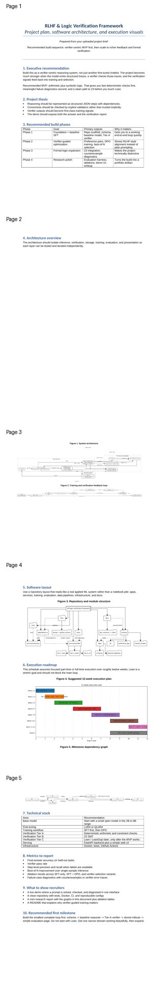
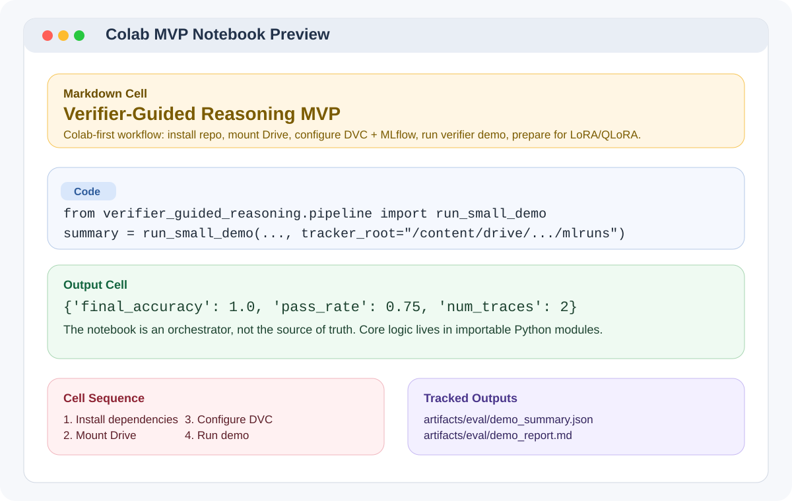
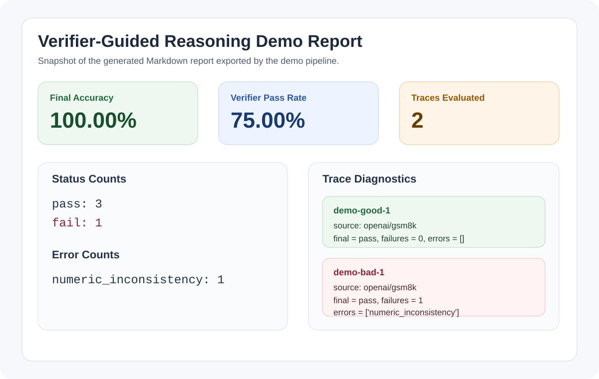

# RLHF-Logic-Verification-Framework

<p align="center">
  
  
  
  
  
</p>

This repository keeps the original project name, but the implementation is deliberately scoped as a `verifier-guided process supervision` project rather than a full end-to-end RLHF platform.

The core idea is simple:

1. convert reasoning examples into structured traces,
2. verify each trace with explicit deterministic checks,
3. use those verifier signals for dataset QA, evaluation, and later preference construction,
4. keep the whole workflow reproducible in a Colab-first setup.

The current MVP is arithmetic-first and portfolio-oriented. It is designed to be technically honest, easy to demo, and strong enough to discuss in interviews without overclaiming formal verification or large-scale RLHF results.

## Project Overview

<p align="center">
  
</p>

<p align="center">
  <em>A recruiter-friendly project brief covering the system architecture, training loop, repository layout, timeline, and milestone dependencies.</em>
</p>

### At A Glance

| Area | Summary |
|---|---|
| Framing | Verifier-guided process supervision for reasoning traces |
| MVP Domain | Arithmetic reasoning with structured steps |
| Core Loop | `dataset -> trace schema -> verifier -> quality gate -> evaluation -> report` |
| Primary Value | Step-level diagnostics instead of answer-only scoring |
| Workflow | Colab-first, DVC-tracked artifacts, MLflow-compatible runs |
| Stretch Path | Preference mining, DPO, Z3-backed checks, later formal logic work |

### Visual Overview

<table>
  <tr>
    <td width="50%" valign="top">
      <strong>System Architecture</strong><br />
      
      <br />
      The system isolates inference, verification, storage, evaluation, and presentation so each layer can be tested independently.
    </td>
    <td width="50%" valign="top">
      <strong>Repository Layout</strong><br />
      
      <br />
      The repo is organized like a real applied ML project rather than a notebook pile, with clear boundaries between schemas, verification, evaluation, and training support code.
    </td>
  </tr>
  <tr>
    <td width="50%" valign="top">
      <strong>Execution Roadmap</strong><br />
      
      <br />
      The public plan narrows the work into an arithmetic-first core path before any expensive or risky extensions.
    </td>
    <td width="50%" valign="top">
      <strong>Milestone Dependencies</strong><br />
      
      <br />
      Milestones are sequenced so the verifier-centric MVP ships first and later research features remain additive instead of blocking delivery.
    </td>
  </tr>
</table>

### Why This README Starts With Visuals

This repository is meant to read well on GitHub for a recruiter, collaborator, or hiring manager who may spend less than two minutes on the page.

The visuals help communicate three things quickly:

- this is a systems project, not just a fine-tuning experiment,
- the build has a realistic execution plan,
- the codebase is organized around verifiable intermediate artifacts.

## Demo Snapshot

<table>
  <tr>
    <td width="50%" valign="top">
      <strong>Colab / Notebook Flow</strong><br />
      
    </td>
    <td width="50%" valign="top">
      <strong>Generated Report Preview</strong><br />
      
    </td>
  </tr>
</table>

<details>
  <summary><strong>Quick Demo Run And Results</strong></summary>

Run the smallest end-to-end demo with:

```bash
python3 scripts/prepare_datasets.py --demo --output data/processed/demo_arithmetic.jsonl
python3 scripts/run_small_demo.py \
  --input data/processed/demo_arithmetic.jsonl \
  --output artifacts/eval/demo_summary.json \
  --report-md artifacts/eval/demo_report.md
```

Sample report excerpt:

```text
# Verifier-Guided Reasoning Demo Report

## Summary
- Traces evaluated: 2
- Final-answer accuracy: 100.00%
- Mean verifier pass rate: 75.00%

## Error Counts
- numeric_inconsistency: 1
```

What this demonstrates:

- the trace schema can represent step-level arithmetic reasoning,
- the verifier can catch a bad intermediate computation even when the final answer field is parseable,
- the pipeline exports both machine-readable and recruiter-friendly artifacts.
</details>

## What This Project Is

This project is a scaffold for building and evaluating reasoning systems that expose their intermediate steps as structured records.

Instead of treating the model as a black box that emits a final answer, the project treats a response as a trace with:

- a problem statement,
- a sequence of structured reasoning steps,
- a final answer,
- a verifier report describing whether the steps are consistent.

That framing lets you do useful work before expensive model training:

- filter bad traces out of a candidate SFT dataset,
- measure what kinds of reasoning failures occur,
- compare prompted outputs against verifier-reranked outputs,
- build preference pairs from verifier margins later.

## Why This Framing Matters

The strongest version of this project is not “I built a frontier RLHF stack.”

The strongest version is:

> I built a verifier-guided reasoning pipeline that turns multi-step answers into structured traces, checks those traces with explicit validators, and uses the resulting diagnostics for curation, evaluation, and training data improvement.

That story is more realistic for a Colab-first portfolio build, and it aligns much better with work in:

- data curation,
- process supervision,
- rubric design,
- logic/error diagnosis,
- reasoning-focused evaluation.

## Current Scope

The implemented codebase focuses on an arithmetic MVP.

Included now:

- canonical schemas for traces, steps, verifier outputs, quality gates, and preference pairs,
- a deterministic arithmetic verifier,
- dataset normalization helpers for GSM8K and Calc-SVAMP-like records,
- benchmark summarization and report generation,
- an MLflow wrapper with a local JSON fallback,
- demo scripts and a Colab notebook,
- roadmap and resume-positioning docs.

Intentionally not treated as done:

- DPO training,
- Z3-backed symbolic verification,
- Lean or LeanDojo integration,
- large-scale training orchestration,
- a production UI.

Those belong to later phases once the arithmetic data path and verifier loop are stable.

## Repository Tour

```text
src/verifier_guided_reasoning/
  __init__.py           Public package exports
  schemas.py            Canonical dataclasses and validation logic
  arithmetic.py         Deterministic arithmetic verifier
  datasets.py           Dataset transforms and quality gates
  evaluation.py         Benchmark-level summaries
  preferences.py        Preference-pair construction helpers
  reporting.py          Markdown + JSON report generation
  tracking.py           MLflow wrapper with local fallback
  pipeline.py           Small end-to-end demo orchestration

scripts/
  prepare_datasets.py   Build a gated demo JSONL file
  run_small_demo.py     Run the verifier demo and export a report

tests/
  test_arithmetic_verifier.py
  test_dataset_transforms.py

notebooks/
  colab_mvp_pipeline.ipynb

docs/
  colab_workflow.md
  roadmap.md
  resume_alignment.md
  data_contracts.md
  code_reference.md
```

## System Flow

The current project flow is:

`raw row -> normalized TraceRecord -> schema validation -> arithmetic verification -> quality gate -> benchmark summary -> report + tracked artifacts`

In concrete terms:

1. dataset rows are normalized into a `TraceRecord`,
2. each step becomes a `StepRecord`,
3. the verifier recomputes arithmetic expressions and checks consistency,
4. failures are emitted as `VerifierResult` objects,
5. the dataset gate collapses those checks into a `QualityGateResult`,
6. accepted traces can later feed SFT or preference mining.

## Core Data Contracts

The project is built around a small set of canonical records defined in [`src/verifier_guided_reasoning/schemas.py`](src/verifier_guided_reasoning/schemas.py).

### `StepRecord`

Represents one reasoning step.

| Field | Meaning |
|---|---|
| `step_id` | Stable step identifier such as `s1` |
| `text` | Human-readable step text |
| `operation` | Category like `arithmetic`, `calculator`, `explanation` |
| `expression` | Arithmetic expression to recompute, if available |
| `computed_value` | Numeric value claimed by the step |
| `depends_on` | Prior step ids that this step relies on |

### `TraceRecord`

Represents the full reasoning example.

| Field | Meaning |
|---|---|
| `sample_id` | Unique row identifier |
| `source_dataset` | Dataset provenance |
| `question` | Original prompt or problem statement |
| `steps` | Ordered list of `StepRecord` instances |
| `final_answer` | Answer produced by the trace |
| `gold_answer` | Reference answer |
| `split` | Dataset split such as `train`, `test`, `demo` |
| `metadata` | Extra dataset-specific information |

### `VerifierResult`

One verifier judgment for either a step or the final answer.

| Field | Meaning |
|---|---|
| `sample_id` | Example identifier |
| `step_id` | Step being judged, or `final` |
| `status` | `pass` or `fail` |
| `error_type` | Failure category |
| `expected` | Expected value or condition |
| `observed` | Observed value from the trace |
| `message` | Human-readable diagnostic |
| `score` | Numeric pass/fail score |

### `QualityGateResult`

Collapses schema validation and verifier agreement into a single dataset-ingestion decision.

### `PreferencePair`

Stores a chosen/rejected pair for later preference optimization once the verifier-margin workflow is mature.

More detail and a full JSON example live in [`docs/data_contracts.md`](docs/data_contracts.md).

## What The Arithmetic Verifier Checks

The deterministic verifier in [`src/verifier_guided_reasoning/arithmetic.py`](src/verifier_guided_reasoning/arithmetic.py) currently supports:

- safe evaluation of arithmetic expressions using a restricted AST walker,
- comparison between recomputed and claimed numeric values,
- reuse of prior step outputs via step ids,
- simple unit mismatch detection in step text,
- skipped-step detection when a new value appears without a derivation,
- final-answer validation against both the gold answer and established values.

Common error labels include:

- `numeric_inconsistency`
- `sign_error`
- `unit_mismatch`
- `missing_dependency`
- `missing_expression`
- `missing_computed_value`
- `invalid_expression`
- `skipped_step`
- `final_answer_mismatch`

## Dataset Support

The repo currently includes lightweight parsing and normalization for:

- `openai/gsm8k`
- `MU-NLPC/Calc-svamp`

Current behavior:

- GSM8K answers are parsed by extracting inline `<<expr=result>>` arithmetic annotations and the `#### final_answer` line.
- Calc-SVAMP-style chains are parsed from `<gadget>`, `<output>`, and `<result>` tags.
- If a row cannot produce a valid structured trace, it can be rejected by the quality gate before training.

The project plan still reserves:

- `tasksource/folio` for logic evaluation only,
- `tasksource/proofwriter` or sampled `hitachi-nlp/ruletaker` for later logic extension,
- `trl-lib/prm800k` for future step-label or error-analysis work.

## Running The Project

### Local setup

```bash
python3 -m venv .venv
source .venv/bin/activate
python3 -m pip install -e .[dev]
pytest
```

### Prepare demo data

```bash
python3 scripts/prepare_datasets.py --demo --output data/processed/demo_arithmetic.jsonl
```

This creates a small JSONL file of structured traces and writes rejected examples separately if they fail the quality gate.

### Run the demo pipeline

```bash
python3 scripts/run_small_demo.py \
  --input data/processed/demo_arithmetic.jsonl \
  --output artifacts/eval/demo_summary.json \
  --report-md artifacts/eval/demo_report.md
```

This script:

- loads traces,
- verifies them,
- summarizes benchmark metrics,
- logs params/metrics/artifacts through the tracker,
- exports JSON and Markdown reports.

## Colab Workflow

The public orchestration surface is [`notebooks/colab_mvp_pipeline.ipynb`](notebooks/colab_mvp_pipeline.ipynb).

The intended Colab flow is:

1. mount Google Drive,
2. install the repo plus Colab extras,
3. configure DVC to use a mounted Drive path as the remote,
4. store MLflow runs on Drive,
5. run the arithmetic demo,
6. later move into LoRA or QLoRA SFT once trace quality is stable.

See [`docs/colab_workflow.md`](docs/colab_workflow.md) for the exact commands and paths.

## DVC And MLflow

This repo uses a deliberately simple reproducibility stack:

- `DVC` for dataset snapshots and generated artifacts,
- `MLflow` for params, metrics, and run-level artifacts,
- a local JSON fallback when MLflow is not installed.

Important design choice:

- use a mounted Drive filesystem path as the first DVC remote in Colab,
- do not make DVC’s direct Google Drive remote the default path for the MVP.

That keeps the first setup path less fragile and easier to explain.

## Testing

Current tests cover:

- numeric consistency,
- unit mismatches,
- sign-like arithmetic failures,
- skipped-step detection,
- final-answer mismatches,
- GSM8K parsing,
- Calc-SVAMP chain extraction,
- quality-gate acceptance for a valid trace.

Tests live in [`tests/test_arithmetic_verifier.py`](tests/test_arithmetic_verifier.py) and [`tests/test_dataset_transforms.py`](tests/test_dataset_transforms.py).

## Code Reference

For a module-by-module reference, see [`docs/code_reference.md`](docs/code_reference.md).

For the data schema and JSON examples, see [`docs/data_contracts.md`](docs/data_contracts.md).

## Current Limitations

The current implementation is intentionally modest.

- The verifier is arithmetic-focused and heuristic, not a full symbolic proof checker.
- Dataset normalization currently targets only a small number of source formats.
- The notebook scaffolds an SFT path, but it does not yet run full LoRA training in-repo.
- Preference-pair mining exists as a helper, but DPO is still a later-phase extension.
- Logic datasets are part of the roadmap, not the shipped MVP.

These are reasonable constraints for a Colab-first portfolio artifact, and they help keep the claims accurate.

## Roadmap

The working roadmap is an `8-week core path` plus a `2-4 week stretch path`.

- Weeks 1-2: schema, verifier, notebook, DVC/MLflow
- Weeks 3-4: arithmetic trace curation and SFT baseline
- Weeks 5-6: verifier scoring, best-of-N, diagnostics
- Weeks 7-8: narrow logic extension and project polish
- Stretch: DPO, Z3-backed checks, LeanDojo exploration

Full planning notes are in [`docs/roadmap.md`](docs/roadmap.md).

## Resume Positioning

The best way to present this project is around:

- process supervision,
- reasoning trace curation,
- deterministic validation,
- logical failure diagnosis,
- data quality gating,
- experiment reproducibility.

Suggested phrasing lives in [`docs/resume_alignment.md`](docs/resume_alignment.md).
