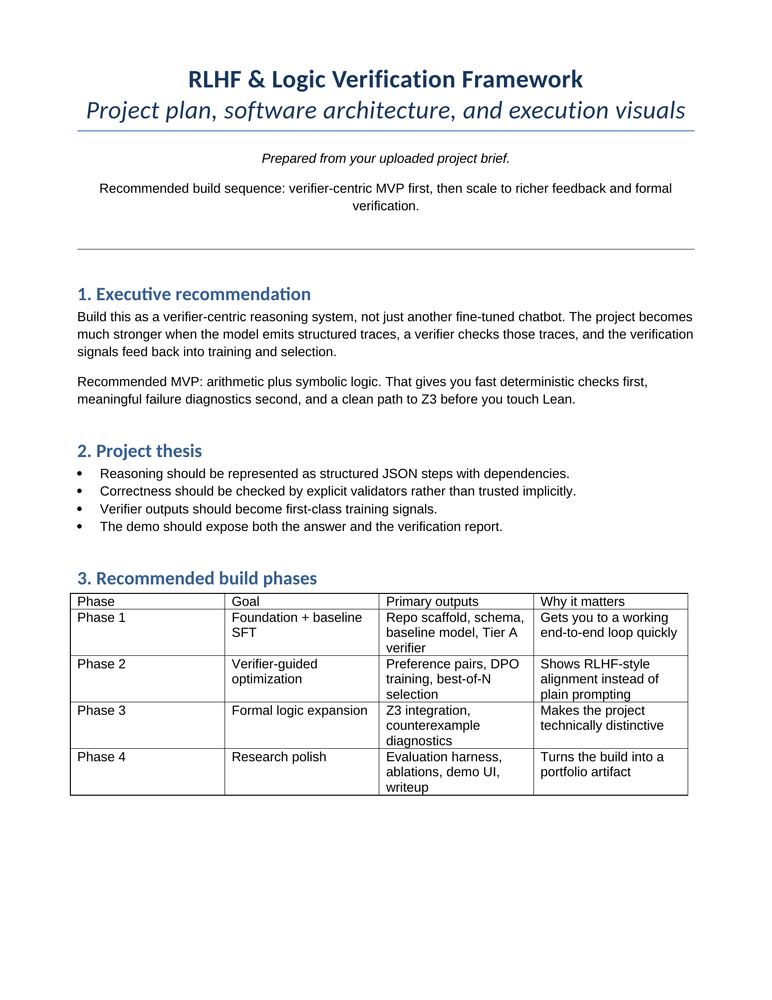
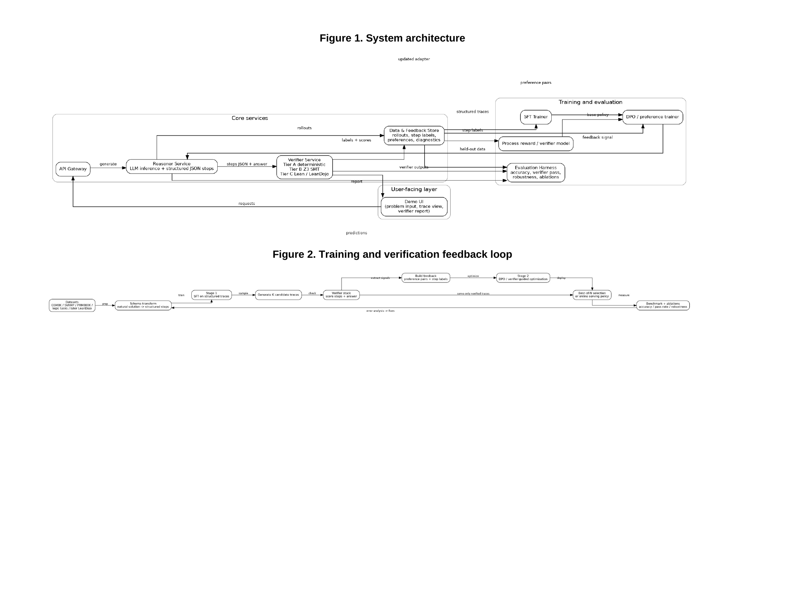
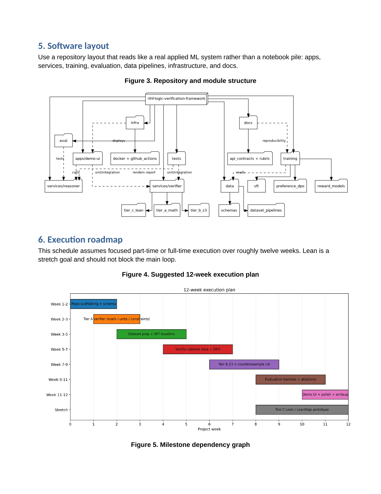
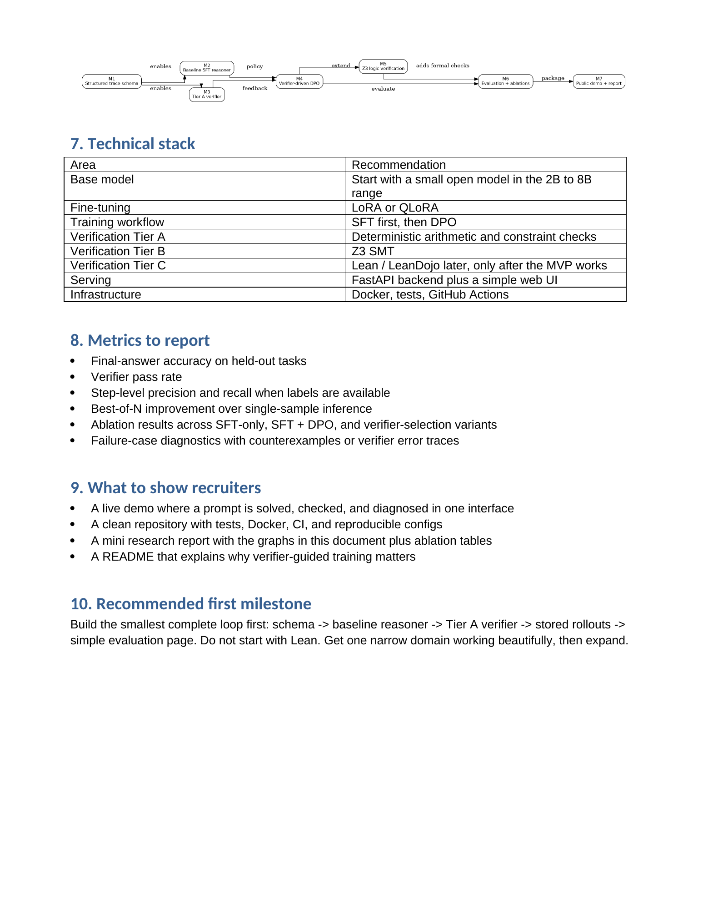
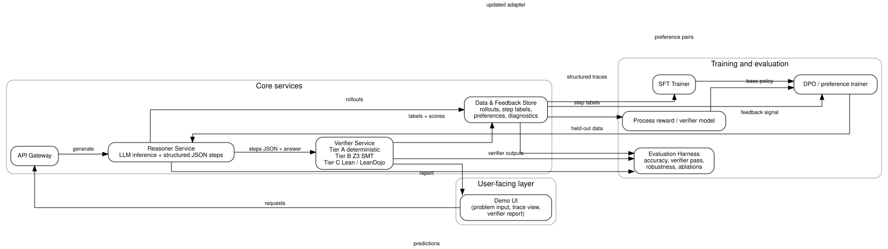
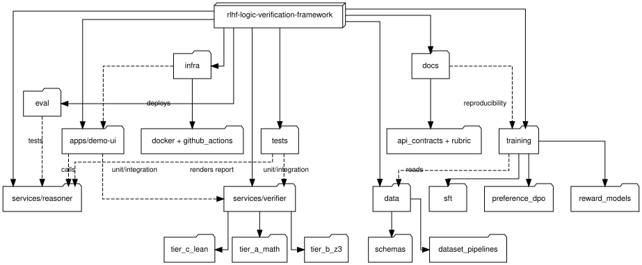
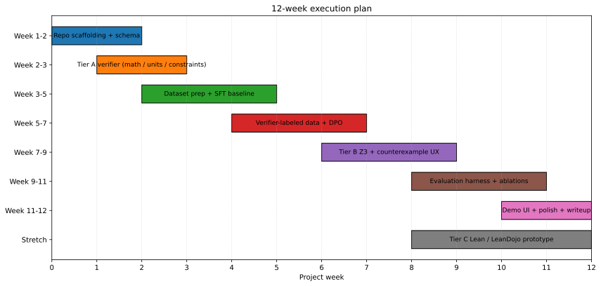
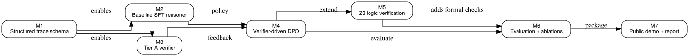

# Verifier-Guided Reasoning Framework

<p align="center">
  
  
  
  
  
  
</p>

A **verifier-guided process supervision** framework that converts multi-step reasoning into structured traces, validates them with deterministic checks, and uses the diagnostics for data curation, evaluation, and preference learning.

## What This Project Does

Instead of treating model outputs as black-box answers, this framework:

1. **Structures reasoning** into explicit step-by-step traces
2. **Validates deterministically** with arithmetic and logic verifiers
3. **Curates data quality** through automated gates and human review
4. **Enables preference learning** from verifier-derived signals
5. **Maintains reproducibility** with Colab-first workflows and artifact tracking

### Core Innovation: Process Supervision

The key insight is **step-level validation** rather than answer-only scoring. This enables:

- **Automated quality gates** before training data acceptance
- **Diagnostic failure analysis** for reasoning improvement
- **Preference pair mining** from objective verifier margins
- **Human curation workflows** with meaningful context

### Current Capabilities

✅ **Arithmetic Verification**: Structured math traces with step-by-step validation  
✅ **Logic Extension**: FOL entailment checking with separate evaluation  
✅ **DPO Training**: Preference learning from verifier-derived pairs  
✅ **Dataset Integration**: Load and curate pairs from Math-Shepherd, HH-RLHF  
✅ **Interactive Curation**: Jupyter widgets for preference pair selection  
✅ **Colab-First Workflow**: Mount Drive, DVC tracking, MLflow logging  
✅ **Data Contracts**: Structured schemas for traces, preferences, and reviews

## Project Overview

<p align="center">
  
</p>

<p align="center">
  <em>Readable page-by-page project brief preview. The original stitched overview image was replaced because GitHub scaled it down too aggressively to be legible.</em>
</p>

<p align="center">
  <a href="docs/visual_guide.md"><strong>Open Full Visual Guide</strong></a>
  ·
  <a href="docs/assets/project-brief/RLHF_Logic_Verification_Project_Plan.pdf"><strong>Open Project Brief PDF</strong></a>
</p>

<details>
  <summary><strong>View All Project Brief Pages</strong></summary>

  <p align="center">
    
  </p>

  <p align="center">
    
  </p>

  <p align="center">
    
  </p>

  <p align="center">
    
  </p>

  <p align="center">
    
  </p>
</details>

### At A Glance

| Area | Summary |
|---|---|
| **Framing** | Verifier-guided process supervision for reasoning traces |
| **MVP Domain** | Arithmetic reasoning with structured steps + logic extension |
| **Core Loop** | `dataset → trace schema → verifier → quality gate → evaluation → report` |
| **Primary Value** | Step-level diagnostics instead of answer-only scoring |
| **Training Support** | SFT baselines + DPO from verifier-derived preferences |
| **Data Curation** | Interactive preference pair selection from common datasets |
| **Workflow** | Colab-first, DVC-tracked artifacts, MLflow-compatible runs |
| **Stretch Path** | Z3-backed checks, formal logic work, advanced preference mining |

### Key Features

🔍 **Structured Trace Validation**
- Convert raw responses into step-by-step reasoning traces
- Validate arithmetic operations and logical entailments
- Generate diagnostic reports for failure analysis

🎯 **Data Quality Gates**
- Automated filtering of low-quality reasoning traces
- Schema validation and verifier-based acceptance criteria
- Human review workflows with contextual feedback

🎛️ **Interactive Curation Interface**
- Load preference pairs from Math-Shepherd, HH-RLHF datasets
- Override automatic preferences with human judgment
- Export curated pairs for DPO training

📊 **Preference Learning Pipeline**
- Mine preference pairs from verifier score margins
- Train DPO models on curated preference datasets
- Compare SFT vs DPO performance on reasoning tasks

🔄 **Reproducible Workflows**
- Colab-first setup with Google Drive integration
- DVC for data versioning, MLflow for experiment tracking
- Artifact-based pipeline with clear data contracts

### Visual Overview

<table>
  <tr>
    <td width="50%" valign="top">
      <strong>System Architecture</strong><br />
      
      <br />
      The system isolates inference, verification, storage, evaluation, and presentation so each layer can be tested independently.
    </td>
    <td width="50%" valign="top">
      <strong>Repository Layout</strong><br />
      
      <br />
      The repo is organized like a real applied ML project rather than a notebook pile, with clear boundaries between schemas, verification, evaluation, and training support code.
    </td>
  </tr>
  <tr>
    <td width="50%" valign="top">
      <strong>Execution Roadmap</strong><br />
      
      <br />
      The public plan narrows the work into an arithmetic-first core path before any expensive or risky extensions.
    </td>
    <td width="50%" valign="top">
      <strong>Milestone Dependencies</strong><br />
      
      <br />
      Milestones are sequenced so the verifier-centric MVP ships first and later research features remain additive instead of blocking delivery.
    </td>
  </tr>
</table>

### Why This README Starts With Visuals

This repository is meant to read well on GitHub for a recruiter, collaborator, or hiring manager who may spend less than two minutes on the page.

The visuals help communicate three things quickly:

- this is a systems project, not just a fine-tuning experiment,
- the build has a realistic execution plan,
- the codebase is organized around verifiable intermediate artifacts.

## Quick Start

### 1. Run Arithmetic Demo

```bash
# Prepare demo data
python scripts/prepare_datasets.py --demo --output data/processed/demo_arithmetic.jsonl

# Run verifier-guided evaluation
python scripts/run_small_demo.py \
  --input data/processed/demo_arithmetic.jsonl \
  --output artifacts/eval/demo_summary.json \
  --report-md artifacts/eval/demo_report.md
```

### 2. Try DPO Training

```bash
# Generate preference pairs from verifier scores
python scripts/generate_dpo_pairs.py \
  --model "Qwen/Qwen2.5-1.5B-Instruct" \
  --num-prompts 50 \
  --output data/processed/dpo_pairs.jsonl

# Train DPO model
python scripts/run_dpo.py \
  --pairs-file data/processed/dpo_pairs.jsonl \
  --model "Qwen/Qwen2.5-1.5B-Instruct" \
  --output-dir artifacts/models/dpo
```

### 3. Interactive Preference Curation

Open `notebooks/colab_mvp_pipeline.ipynb` in Colab and run the **Interactive Preference Pair Selection** section to:
- Load pairs from Math-Shepherd or HH-RLHF datasets
- Review and override automatic preferences
- Export curated pairs for training

## Architecture Overview

<table>
  <tr>
    <td width="50%" valign="top">
      <strong>Data Flow</strong><br />
      
      <br />
      Datasets → Trace Schema → Verifier → Quality Gates → Training Data
    </td>
    <td width="50%" valign="top">
      <strong>Training Options</strong><br />
      
      <br />
      SFT on accepted traces + DPO on preference pairs from verifier margins
    </td>
  </tr>
</table>

## Documentation

📋 **[Project Explanation](docs/section_0_project_explanation.md)** - Technical overview and system design  
📊 **[Data Contracts](docs/data_contracts.md)** - Schema definitions and validation rules  
🎯 **[Resume Alignment](docs/resume_alignment.md)** - How this fits data curation and evaluation roles  
🧭 **[Visual Guide](docs/visual_guide.md)** - System architecture and workflow diagrams  
📝 **[Colab Workflow](docs/colab_workflow.md)** - Step-by-step Google Colab setup  
🛣️ **[Roadmap](docs/roadmap.md)** - 8-week development plan and milestones  
📖 **[Code Reference](docs/code_reference.md)** - API documentation and implementation details

## What This Project Is

This project implements **verifier-guided process supervision** for reasoning systems.

### Core Innovation

Instead of black-box answer evaluation, the framework treats responses as **structured reasoning traces** with explicit intermediate steps that can be validated deterministically.

### Training Approaches

**Supervised Fine-Tuning (SFT):**
- Filter reasoning traces through verifier quality gates
- Train on accepted high-quality examples
- Focus on step-by-step reasoning patterns

**Direct Preference Optimization (DPO):**
- Generate preference pairs from verifier score margins
- Load and curate pairs from existing datasets (Math-Shepherd, HH-RLHF)
- Optimize models to prefer verifier-approved reasoning

### Why This Matters

The strongest positioning is **data quality and process supervision** rather than "full RLHF":

> Built a verifier-guided reasoning pipeline that structures multi-step answers into validated traces, enables automated quality filtering, supports interactive preference curation, and provides diagnostic feedback for reasoning improvement.

This aligns with real ML engineering work in data curation, evaluation design, and iterative model improvement.

## DPO vs RLHF: Project Positioning

### This Project is Primarily **Direct Preference Optimization (DPO)**

**Why DPO over RLHF:**
- **No reward model training** - Preferences come directly from deterministic verifiers
- **Simpler and more stable** - DPO trains one model instead of three (policy + reward + value)
- **Verifier-derived preferences** - Objective quality signals rather than human labels
- **Colab-compatible** - Lightweight enough for portfolio demonstration

**DPO Implementation:**
- Mine preference pairs from verifier score differences
- Load curated pairs from existing datasets (Math-Shepherd, HH-RLHF)
- Interactive curation interface for human oversight
- Single-stage training with implicit reward modeling

**Not Full RLHF:**
- No PPO training loop with live environment interaction
- No separate reward model training and deployment
- No complex hyperparameter tuning for RL stability
- Focus on preference learning from static datasets

### Relationship to RLHF

This project demonstrates the **data preparation and preference construction** phase of RLHF:
- How to create high-quality preference datasets
- How to validate reasoning quality deterministically  
- How to combine automated and human curation
- How to evaluate preference learning approaches

The actual RLHF training (PPO, etc.) would be the next step for production systems, but DPO provides an excellent intermediate approach that's more accessible for research and portfolio work.

## Current Status & Capabilities

### ✅ Completed (Weeks 1-2 Core + DPO Implementation)

**Verifier-Guided Pipeline:**
- Structured trace schema with validation
- Deterministic arithmetic verifier with step-level checks
- Logic extension with FOL entailment verification
- Quality gates for dataset filtering
- Diagnostic reporting and failure analysis

**Training & Curation:**
- SFT training on accepted traces
- DPO training with verifier-derived preferences
- Interactive preference pair curation interface
- Dataset integration (Math-Shepherd, HH-RLHF, GSM8K, Calc-SVAMP)
- Colab-first workflow with Drive mounting

**Infrastructure:**
- DVC data versioning and MLflow experiment tracking
- Reproducible artifact generation
- Dataset card utilities for publication
- Comprehensive test coverage

### 🚧 Ready for Implementation (Weeks 3-4)

**Data Pipeline Expansion:**
- Full GSM8K and Calc-SVAMP normalization
- Large-scale preference pair mining
- Automated dataset quality assessment
- Benchmark evaluation suites

### 🔮 Future Extensions (Stretch Goals)

**Advanced Verification:**
- Z3-backed symbolic arithmetic checking
- Lean/LeanDojo integration for formal proofs
- Multi-modal reasoning verification

**Production Features:**
- Large-scale training orchestration
- Web UI for curation workflows
- API endpoints for model serving
- Integration with existing ML platforms

### Repository Tour

```text
src/verifier_guided_reasoning/
  __init__.py           Public package exports
  schemas.py            Canonical dataclasses and validation logic
  arithmetic.py         Deterministic arithmetic verifier
  datasets.py           Dataset transforms and quality gates
  evaluation.py         Benchmark-level summaries
  logic.py              Narrow logic entailment verifier
  logic_evaluation.py   Logic-only benchmark summaries
  logic_pipeline.py     Logic demo orchestration
  preferences.py        Preference-pair construction helpers
  publishing.py         Artifact hashing and dataset-card utilities
  reporting.py          Markdown + JSON report generation
  tracking.py           MLflow wrapper with local fallback
  pipeline.py           Small end-to-end demo orchestration

scripts/
  generate_review_batch.py   Build verifier-scored candidate review batches
  export_curated_dataset.py  Export accepted SFT rows and preference pairs
  run_sft.py                 Train a small SFT baseline from curated data
  prepare_datasets.py   Build a gated demo JSONL file
  run_small_demo.py     Run the verifier demo and export a report
  run_logic_demo.py     Run the logic-extension verifier demo
  build_dataset_card.py Create publish-ready dataset cards with artifact hashes

tests/
  test_arithmetic_verifier.py
  test_logic_extension.py
  test_dataset_transforms.py

notebooks/
  colab_mvp_pipeline.ipynb
```
- dataset normalization helpers for GSM8K and Calc-SVAMP-like records,
- benchmark summarization and report generation,
- an MLflow wrapper with a local JSON fallback,
- demo scripts and a Colab notebook,
- roadmap and resume-positioning docs.

Intentionally not treated as done:

- DPO training,
- Z3-backed symbolic verification,
- Lean or LeanDojo integration,
- large-scale training orchestration,
- a production UI.

Those belong to later phases once the arithmetic data path and verifier loop are stable.

## Repository Tour

```text
src/verifier_guided_reasoning/
  __init__.py           Public package exports
  schemas.py            Canonical dataclasses and validation logic
  arithmetic.py         Deterministic arithmetic verifier
  datasets.py           Dataset transforms and quality gates
  evaluation.py         Benchmark-level summaries
  logic.py              Narrow logic entailment verifier
  logic_evaluation.py   Logic-only benchmark summaries
  logic_pipeline.py     Logic demo orchestration
  preferences.py        Preference-pair construction helpers
  publishing.py         Artifact hashing and dataset-card utilities
  reporting.py          Markdown + JSON report generation
  tracking.py           MLflow wrapper with local fallback
  pipeline.py           Small end-to-end demo orchestration

scripts/
  generate_review_batch.py   Build verifier-scored candidate review batches
  export_curated_dataset.py  Export accepted SFT rows and preference pairs
  run_sft.py                 Train a small SFT baseline from curated data
  prepare_datasets.py   Build a gated demo JSONL file
  run_small_demo.py     Run the verifier demo and export a report
  run_logic_demo.py     Run the logic-extension verifier demo
  build_dataset_card.py Create publish-ready dataset cards with artifact hashes

tests/
  test_arithmetic_verifier.py
  test_logic_extension.py
  test_dataset_transforms.py

notebooks/
  colab_mvp_pipeline.ipynb

docs/
  section_0_project_explanation.md
  colab_workflow.md
  visual_guide.md
  roadmap.md
  resume_alignment.md
  data_contracts.md
  code_reference.md
```

## System Flow

The current project flow is:

`raw row -> normalized TraceRecord -> schema validation -> arithmetic verification -> quality gate -> benchmark summary -> report + tracked artifacts`

In concrete terms:

1. dataset rows are normalized into a `TraceRecord`,
2. each step becomes a `StepRecord`,
3. the verifier recomputes arithmetic expressions and checks consistency,
4. failures are emitted as `VerifierResult` objects,
5. the dataset gate collapses those checks into a `QualityGateResult`,
6. accepted traces can later feed SFT or preference mining.

## Core Data Contracts

The project is built around a small set of canonical records defined in [`src/verifier_guided_reasoning/schemas.py`](src/verifier_guided_reasoning/schemas.py).

### `StepRecord`

Represents one reasoning step.

| Field | Meaning |
|---|---|
| `step_id` | Stable step identifier such as `s1` |
| `text` | Human-readable step text |
| `operation` | Category like `arithmetic`, `calculator`, `explanation` |
| `expression` | Arithmetic expression to recompute, if available |
| `computed_value` | Numeric value claimed by the step |
| `depends_on` | Prior step ids that this step relies on |

### `TraceRecord`

Represents the full reasoning example.

| Field | Meaning |
|---|---|
| `sample_id` | Unique row identifier |
| `source_dataset` | Dataset provenance |
| `question` | Original prompt or problem statement |
| `steps` | Ordered list of `StepRecord` instances |
| `final_answer` | Answer produced by the trace |
| `gold_answer` | Reference answer |
| `split` | Dataset split such as `train`, `test`, `demo` |
| `metadata` | Extra dataset-specific information |

### `VerifierResult`

One verifier judgment for either a step or the final answer.

| Field | Meaning |
|---|---|
| `sample_id` | Example identifier |
| `step_id` | Step being judged, or `final` |
| `status` | `pass` or `fail` |
| `error_type` | Failure category |
| `expected` | Expected value or condition |
| `observed` | Observed value from the trace |
| `message` | Human-readable diagnostic |
| `score` | Numeric pass/fail score |

### `QualityGateResult`

Collapses schema validation and verifier agreement into a single dataset-ingestion decision.

### `PreferencePair`

Stores a chosen/rejected pair for later preference optimization once the verifier-margin workflow is mature.

More detail and a full JSON example live in [`docs/data_contracts.md`](docs/data_contracts.md).

## What The Arithmetic Verifier Checks

The deterministic verifier in [`src/verifier_guided_reasoning/arithmetic.py`](src/verifier_guided_reasoning/arithmetic.py) currently supports:

- safe evaluation of arithmetic expressions using a restricted AST walker,
- comparison between recomputed and claimed numeric values,
- reuse of prior step outputs via step ids,
- simple unit mismatch detection in step text,
- skipped-step detection when a new value appears without a derivation,
- final-answer validation against both the gold answer and established values.

Common error labels include:

- `numeric_inconsistency`
- `sign_error`
- `unit_mismatch`
- `missing_dependency`
- `missing_expression`
- `missing_computed_value`
- `invalid_expression`
- `skipped_step`
- `final_answer_mismatch`

## Dataset Support

The repo currently includes lightweight parsing and normalization for:

- `openai/gsm8k`
- `MU-NLPC/Calc-svamp`

Current behavior:

- GSM8K answers are parsed by extracting inline `<<expr=result>>` arithmetic annotations and the `#### final_answer` line.
- Calc-SVAMP-style chains are parsed from `<gadget>`, `<output>`, and `<result>` tags.
- If a row cannot produce a valid structured trace, it can be rejected by the quality gate before training.

The project plan still reserves:

- `tasksource/folio` for logic evaluation only,
- `tasksource/proofwriter` or sampled `hitachi-nlp/ruletaker` for later logic extension,
- `trl-lib/prm800k` for future step-label or error-analysis work.

## Running The Project

### Local setup

```bash
python3 -m venv .venv
source .venv/bin/activate
python3 -m pip install -e .[dev]
pytest
```

### Prepare demo data

```bash
python3 scripts/prepare_datasets.py --demo --output data/processed/demo_arithmetic.jsonl
```

This creates a small JSONL file of structured traces and writes rejected examples separately if they fail the quality gate.

### Run the demo pipeline

```bash
python3 scripts/run_small_demo.py \
  --input data/processed/demo_arithmetic.jsonl \
  --output artifacts/eval/demo_summary.json \
  --report-md artifacts/eval/demo_report.md
```

This script:

- loads traces,
- verifies them,
- summarizes benchmark metrics,
- logs params/metrics/artifacts through the tracker,
- exports JSON and Markdown reports.

## Colab Workflow

The public orchestration surface is [`notebooks/colab_mvp_pipeline.ipynb`](notebooks/colab_mvp_pipeline.ipynb).

The intended Colab flow is:

1. mount Google Drive,
2. install the repo plus Colab extras,
3. configure DVC to use a mounted Drive path as the remote,
4. store MLflow runs on Drive,
5. run the arithmetic demo,
6. later move into LoRA or QLoRA SFT once trace quality is stable.

See [`docs/colab_workflow.md`](docs/colab_workflow.md) for the exact commands and paths.

## DVC And MLflow

This repo uses a deliberately simple reproducibility stack:

- `DVC` for dataset snapshots and generated artifacts,
- `MLflow` for params, metrics, and run-level artifacts,
- a local JSON fallback when MLflow is not installed.

Important design choice:

- use a mounted Drive filesystem path as the first DVC remote in Colab,
- do not make DVC’s direct Google Drive remote the default path for the MVP.

That keeps the first setup path less fragile and easier to explain.

## Testing

Current tests cover:

- numeric consistency,
- unit mismatches,
- sign-like arithmetic failures,
- skipped-step detection,
- final-answer mismatches,
- GSM8K parsing,
- Calc-SVAMP chain extraction,
- quality-gate acceptance for a valid trace.

Tests live in [`tests/test_arithmetic_verifier.py`](tests/test_arithmetic_verifier.py) and [`tests/test_dataset_transforms.py`](tests/test_dataset_transforms.py).

## Code Reference

For a module-by-module reference, see [`docs/code_reference.md`](docs/code_reference.md).

For the data schema and JSON examples, see [`docs/data_contracts.md`](docs/data_contracts.md).

## Current Limitations

The current implementation is intentionally modest.

- The verifier is arithmetic-focused and heuristic, not a full symbolic proof checker.
- Dataset normalization currently targets only a small number of source formats.
- The notebook scaffolds an SFT path, but it does not yet run full LoRA training in-repo.
- Preference-pair mining exists as a helper, but DPO is still a later-phase extension.
- Logic datasets are part of the roadmap, not the shipped MVP.

These are reasonable constraints for a Colab-first portfolio artifact, and they help keep the claims accurate.

## Roadmap

The working roadmap is an `8-week core path` plus a `2-4 week stretch path`.

- Weeks 1-2: schema, verifier, notebook, DVC/MLflow
- Weeks 3-4: arithmetic trace curation and SFT baseline
- Weeks 5-6: verifier scoring, best-of-N, diagnostics
- Weeks 7-8: narrow logic extension and project polish
- Stretch: DPO, Z3-backed checks, LeanDojo exploration

Full planning notes are in [`docs/roadmap.md`](docs/roadmap.md).

## Resume Positioning

The best way to present this project is around:

- process supervision,
- reasoning trace curation,
- deterministic validation,
- logical failure diagnosis,
- data quality gating,
- experiment reproducibility.

Suggested phrasing lives in [`docs/resume_alignment.md`](docs/resume_alignment.md).
